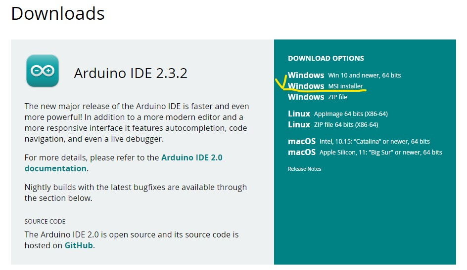
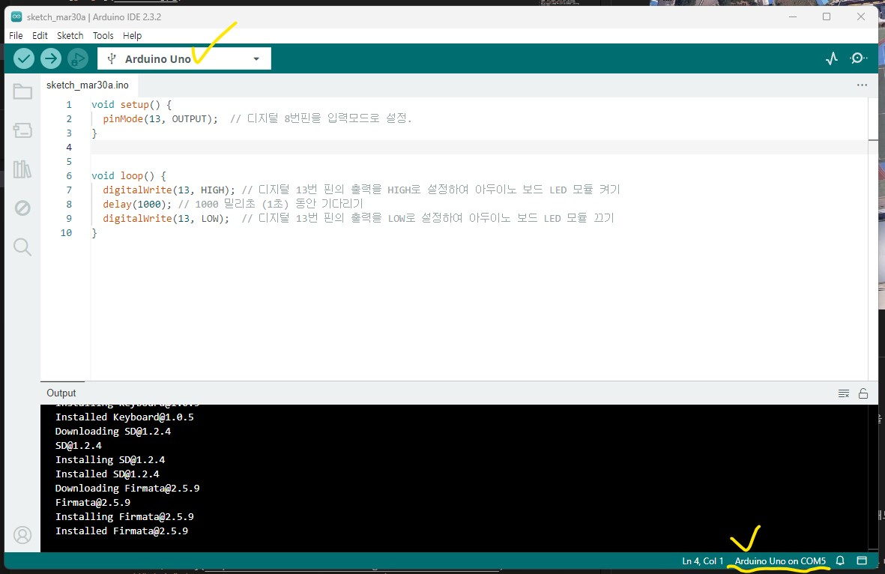
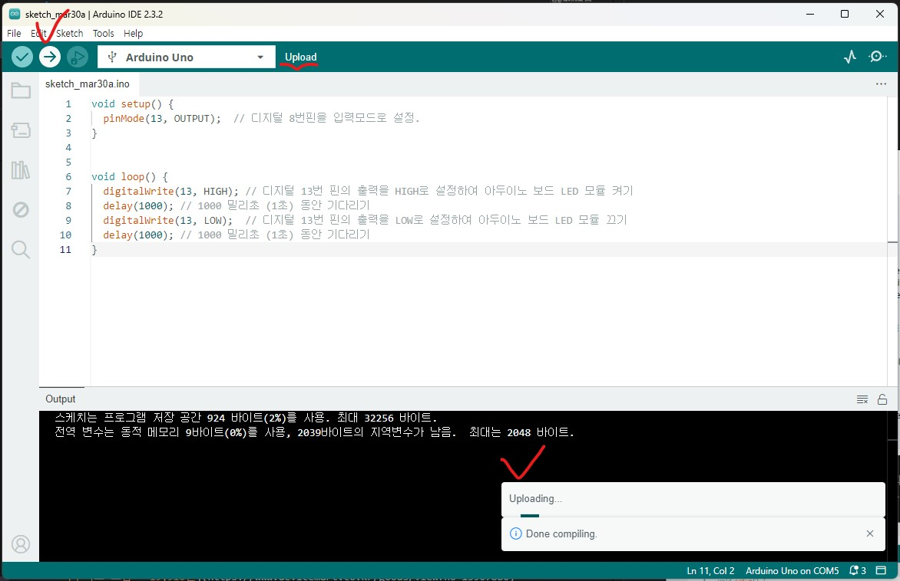

# 진주초등학교 - 코딩교실

선생님의 제자이자 선배님이 가르쳐주는 재미있는 코딩교실!😎

전기와 반도체 그리고 프로그래밍에 대해서 알아보고, 직접 회로와 프로그램을 만들어보자.


## 강의 프로그램 (80분)
1. [강의 소개 (5분)](./introduce)
1. [전기와 반도체 그리고 프로그래밍 (15분)](./semiconductor)
 - 신호와 반도체, 코딩과 프로그래밍의 개념을 이해해보자
1. [LED 켜보기 (20분)](./led)
 - LED에 대해서 알아보고 회로를 통해 빛을 내보자
1. [버튼으로 소리내기 (25분)](./button)
 - 버튼을 눌러서 소리를 내보자
1. [버튼으로 노래 연주하기 (10분)](./play-button)
 - 버튼을 누르면 노래가 연주되는 프로그램을 만들어보자
1. 마무리 (5분)
 - 집으로 돌아 가서도 도전은 계속된다!

## 도전 과제
- [복불복 게임 만들기](./game) - 한 사람씩 버튼을 눌러서 술래를 뽑는 게임 만들기

## 강의 준비
- 프로그래밍할 PC 준비
- 아두이노 IDE를 PC에 설치
- 회로 구성에 필요한 부품 준비, 구성품 확인
- 버튼으로 노래 연주하기로 테스트

### IDE 설치 및 동작 확인
[공식 설치 사이트](https://www.arduino.cc/en/software)에서 MSI Installer를 다운 받아서 설치합니다.



IDE를 실행하고, 아두이노 보드를 PC에 연결합니다. 아래와 같이 보드가 정상적으로 연결되는지 확인합니다. 왼쪽 위 박스에서 연결된 보드를 선택하면 오른쪽 아래 연결 상태 표시됩니다.



동작 확인을 위해서, 아래 프로그램 코드를 복사해서 붙여 넣습니다.

```
void setup() {
  pinMode(13, OUTPUT);  // 디지털 8번핀을 입력모드로 설정.
}


void loop() {
  digitalWrite(13, HIGH); // 디지털 13번 핀의 출력을 HIGH로 설정하여 아두이노 보드 LED 모듈 켜기
  delay(1000); // 1000 밀리초 (1초) 동안 기다리기
  digitalWrite(13, LOW);  // 디지털 13번 핀의 출력을 LOW로 설정하여 아두이노 보드 LED 모듈 끄기
  delay(1000); // 1000 밀리초 (1초) 동안 기다리기
}
```

IDE 프로그램에서 -> 화살표 버튼을 눌러서 아래와 같이 아두이노 보드에 작성한 프로그램 코드를 업로드 합니다.



아두이노 보드에 13번 핀 옆에 LED 불빛이 1초 간격으로 깜빡이는 것을 확인 합니다.

### 사용된 부품 및 가격
- [[디바이스마트] 아두이노 피아노 키트 [SZH-ME010], 케이블 포함 - 25,300원](https://www.devicemart.co.kr/goods/view?no=13068786)
