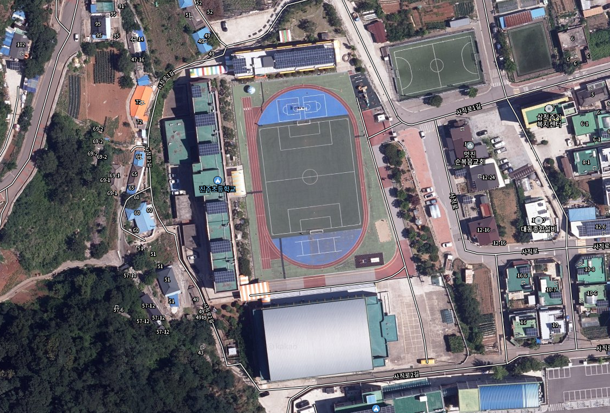

# 진주초등학교 - 코딩교실

선생님의 제자이자 선배님이 가르쳐주는 재미있는 코딩교실!😎

전기와 반도체 그리고 프로그래밍에 대해서 알아보고, 직접 회로와 프로그램을 만들어보자.

## 강의 프로그램
1. [강의 소개 (10분)](./introduce)
1. [전기와 반도체 그리고 프로그래밍 (15분)](./semiconductor)
 - 신호와 반도체, 코딩과 프로그래밍의 개념을 이해해보자
1. [버튼으로 소리내기 (15분)](./button)
 - 버튼을 눌러서 소리를 내보자
1. [LED 켜보기 (15분)](./led)
 - LED에 대해서 알아보고 회로를 통해 빛을 내보자
1. [버튼으로 노래 연주하기 (15분)](./play-button)
 - 버튼을 누르면 노래가 연주되는 프로그램을 만들어보자
1. 마무리 (10분)
 - 집으로 돌아 가서도 도전은 계속된다!

## 도전과제
- [연주에 맞게 LED 켜보기](./led-quiz) - 노래가 연주 될 때 LED도 켜지게 해보자
- [적외선 센서로 LED 켜보기](./infrared) - 사람이 지나가면 불이 켜지게 해보자
- [적외선 센서로 노래 연주하기](./infrared-play) - 사람이 들어오면 멜로디 소리가 나게 해보자

## 사용된 부품 및 가격
- [RC카 기본 세트 - 47,850원](https://www.devicemart.co.kr/goods/view?no=1385495)
- [초음파 센서 브라켓 - 495원](https://www.devicemart.co.kr/goods/view?no=1323060)
- [초음파 센서 - 1,430원](https://www.devicemart.co.kr/goods/view?no=1076851)
- [LED 녹색 - 77원](https://www.devicemart.co.kr/goods/view?no=2853)
- [LED 빨간색 - 77원](https://www.devicemart.co.kr/goods/view?no=2851)
- [저항 220ohm - 15원](https://www.devicemart.co.kr/goods/view?no=890)
- [스위치 - 88원](https://www.devicemart.co.kr/goods/view?no=1361702)
- [피에조 부저 - 330원](https://www.devicemart.co.kr/goods/view?no=1361187)

합계 - 50,362원 (VAT 포함)
