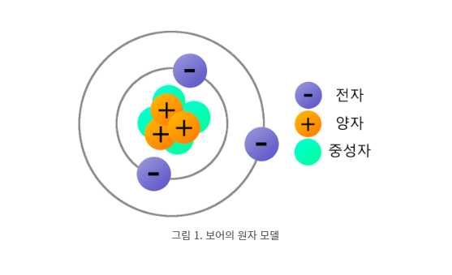
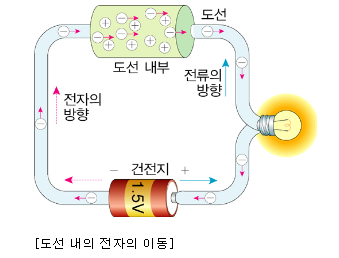
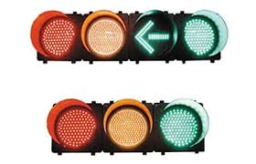
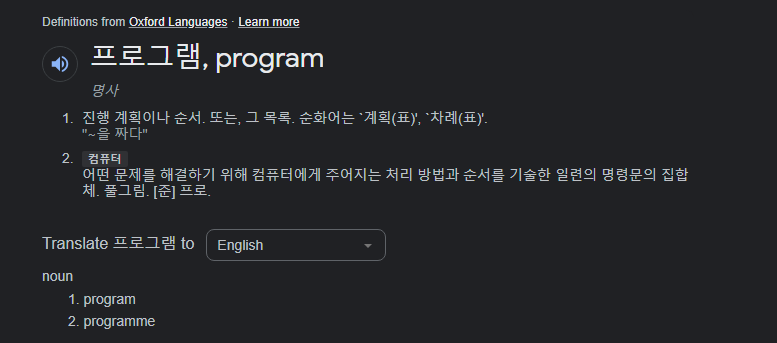
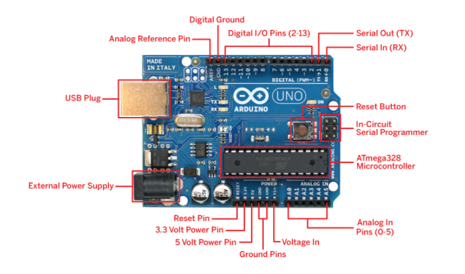
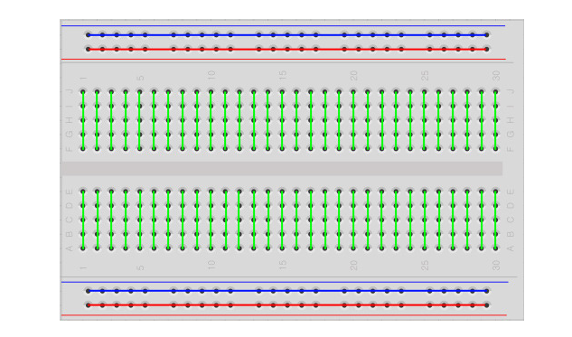

author: Jeong Seongmoon
summary: 전기와 반도체 그리고 프로그래밍
id: semiconductor
categories: codelab
environments: Web
status: Published
feedback link: https://github.com/msaltnet/jinju-coding

# 전기와 반도체 그리고 프로그래밍

## 시작하기
Duration: 0:01:00

자동차를 만들고, 회로를 구성하고, 프로그래밍을해서 자동차를 움직이기 전에 간단한 기본 지식에 대해서 먼저 알아봅시다.

### 배우게 될 것
1. 전기와 전하, 전류 그리고 전기 에너지에 대해서
1. 반도체와 신호에 대해서
1. 프로그래밍은 무엇인가
1. 오늘 사용하게 될 부품에 대해 소개

## 전기와 전하, 전류 그리고 전기 에너지
Duration: 0:03:00

전기는 전하와 관련된 물리현상을 통틀어서 칭하는 것입니다. 우리가 평소에 많이 사용하는 그 전기라는 단어는 전하와 전하가 흐르면서 생기는 현상을 뜻하는 것입니다.

"전기(電氣, 영어: electricity)란 전하의 존재 및 흐름과 관련된 물리현상들의 총체이다. 전기는 번개, 정전기, 전자기 유도, 전류 등 일상적인 효과들의 원인이다. 또한 전기는 전파 따위의 전자기 복사를 발산하고 또한 수집할 수 있다. - 위키백과"

전하는 양전하(+)와 음전하(-)의 고유 성질을 뜻합니다. 자석이랑 비슷하게 같은 것끼리는 서로 밀어내고, 다른 것은 서로 끌어 당깁니다.

**전류는 전하의 흐름입니다.** 물이 흐르듯이 전하가 이동하면서 전류가 흐르게 되며, 전류가 흐르면서 전자 제품이 작동합니다.

**전류를 흐르게 하는 힘이 전기 에너지 입니다.** 우리는 건전지와 콘센트에 전선을 연결해서 전기 에너지를 사용합니다.

전자 기기가 동작하기 위해서 **중요한 것은 전류가 흘러야 한다는 것**이며, 전류가 흐르도록 연결한 길을 **회로**라고 합니다.

<aside class="positive">
사실 자석은 전기가 흐르면서 생기는 자기력으로 모든 자석은 전기가 흐르고 있습니다. 그럼 지구는???
</aside>

## 반도체와 신호
Duration: 0:03:00

금속과 같이 전류가 잘 흐르는 물질을 도체라고 하고, 나무와 같이 잘 흐르지 않는 물질은 부도체(절연체)라고 합니다.

반도체는 전기 중간 정도인 물질을 뜻하는데, **더 중요한 것은 우리가 전류를 잘 흐르거나 흐르지 않게 조절할 수 있다는 것입니다.**

"반도체(半導體, 영어: semiconductor)는 상온에서 전기 전도율이 구리 같은 도체(전도체)하고 애자, 유리 같은 부도체(절연체)의 중간 정도인 물질이다. - 위키백과"

반도체로 전류를 조절해서 할 수 있는 것이 많이 있는데, 그 중 하나로 **신호**를 보낼 수 있어요. 신호란 일정한 부호나 소리 등을 이용해서 정보를 전달하는 것입니다.

신호등의 빨간 신호는 붉은 빛만으로 멈춰야 한다는 것을 알려줍니다. **반도체는 보다 복잡한 신호를 통해서 전자 기기를 조정할 수 있게 해줘요.**

## 프로그래밍
Duration: 0:03:00

프로그램은 어떤 일들의 진행 계획이나 순서, 차례 등을 뜻하는데, 컴퓨터가 어떤 일을 하도록 정리해둔 명령어들의 집합이기도 해요.

여러분이 자주 쓰는 프로그램으로는 유튜브, 네이버와 같은 것이 있어요.

유튜브 프로그램의 아이콘을 누르면 스마트 폰이 인터넷을 통해서 유튜브 회사에서 영상 데이터를 가지고 와서 우리에게 보여줍니다. **프로그래밍은 이처럼 사용자가 프로그램을 사용할 때 프로그램이 어떻게 동작할지 정해서 프로그램을 만드는 것을 의미해요.**

아까 반도체로 복잡한 신호를 만들어서 사용할 수 있다고 했는데, 프로그램을 통해서 **컴퓨터를 조정하는 신호를 보내는 것입니다.**

이 신호로 유튜브 영상을 인터넷에서 가져올 수도 있고, 에어컨을 켜고 끌 수도 있고, 우리가 만들 자동차를 움직일 수도 있어요.

## 부품소개
Duration: 0:03:00

**아두이노** - 간단한 일을 할 수 있는 작은 컴퓨터입니다.

**점퍼선** - 여러 부품을 연결해서 **회로**를 만들때 사용하는 전선입니다. 전류를 흐르게 하기 위해서 꼭 필요합니다.

**브레드 보드** - 점퍼선을 이용해서 쉽고 회로를 만들 수 있는 판이에요. 중앙에는 5개의 구멍이 하나로 연결되어 있고, 옆에 2줄은 각각 1줄씩 길게 모두 연결되어 있어요.

## 정리
Duration: 0:02:00

전기와 전류, 반도체와 프로그래밍 그리고 사용할 부품들에 대해서 알게 되었습니다.

아주 간단하게 소개했는데, 궁금한 것은 인터넷을 찾아보고 알아보면 좋겠습니다.

- 전류는 전하의 흐름이고, 전류가 흘러야 전자 기기가 동작한다.
- 반도체를 통해서 다양한 신호를 전자 기기에 전달할 수 있다.
- 전자 기기를 동작하는 명령어를 정리한 것이 프로그램이고, 프로그램을 만드는 것을 프로그래밍이라고 한다.

### 참고자료
- [자석의 원리 아셨습니까? N극, S극의 근원은? 자석의 자기장 어떻게 나올까?](https://www.youtube.com/watch?v=FU29W6B1eeE)
- [아두이노 부품 설명](https://edu.goorm.io/learn/lecture/203/%ED%95%9C-%EB%88%88%EC%97%90-%EB%81%9D%EB%82%B4%EB%8A%94-%EC%95%84%EB%91%90%EC%9D%B4%EB%85%B8-%EA%B8%B0%EC%B4%88/lesson/6063/%EB%B6%80%ED%92%88-%EC%84%A4%EB%AA%85-%EA%B8%B0%EC%B4%88)
