author: Jeong Seongmoon
summary: 버튼으로 소리내기
id: button
categories: codelab
environments: Web
status: Published
feedback link: https://github.com/msaltnet/jinju-coding

# 버튼으로 소리내기

## 시작하기
Duration: 0:02:00

스위치와 피에조 버저에 대해서 알아보고, 스위치 버튼을 눌러서 피에조 버저를 통해 소리를 내는 회로와 프로그램을 만들어 봅니다.

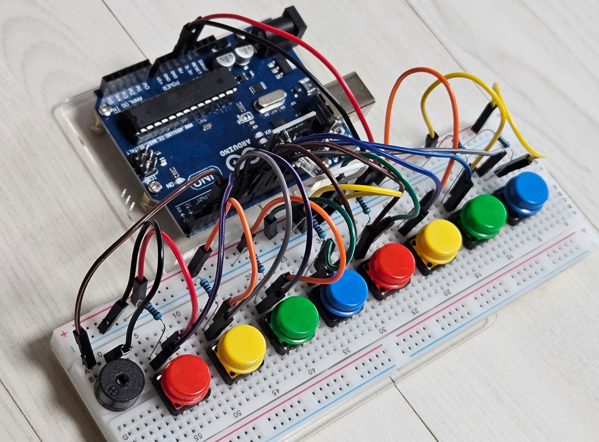

### 사전 준비
1. 아두이노 보드
1. 아두이노와 연결 가능한 PC와 IDE
1. 브레드보드
1. 버튼(택트 스위치) 부품
1. 저항 10K옴
1. 피에조 버저

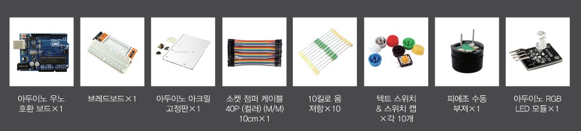

### 배우게 될 것
1. 버튼(스위치)이 무엇인지
1. 버저를 통해 소리가 나는 원리
1. 버튼가 버저를 사용해서 소리는 내는 회로만들어 보기
1. 프로그램 만들고 실행해보기

## 스위치
Duration: 0:03:00

스위치는 회로 중간에서 손쉽게 회로를 연결하거나 끊어주는 역할을 하는 부품입니다.

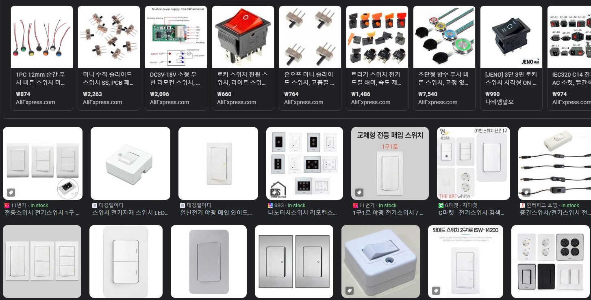

우리가 사용할 부품은 tactile switch로 tact 스위치라고 하는 부품입니다.

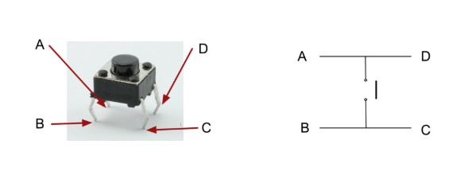

전류를 흘러서 만든 회로는 아래 그림처럼 간단하게 그리기도 합니다.

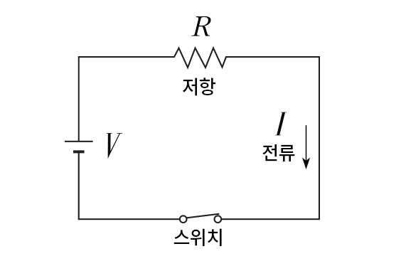

중요한 것은 스위치를 회로에 연결해 줄 때 저항을 같이 연결해줘야 합니다. **저항없이 스위치를 연결하면 회로와 부품이 망가질 수 있어요!!!**

그래서 아래처럼 회로 중간에 저항을 함께 연결해 주어야 해요.

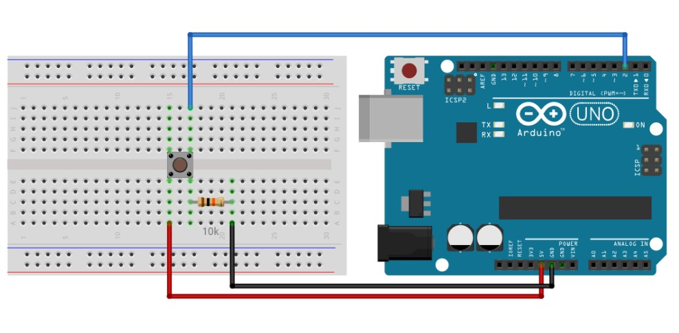

저항을 연결해주는 위치에 따라서 스위치가 눌렸을 때 신호가 다르게 동작하는데, 스위치를 누르지 않았을 때 높은 전압을 유지하도록 하는 것을 Pull-Up, 반대의 경우는 Pull-Down이라고 해요.

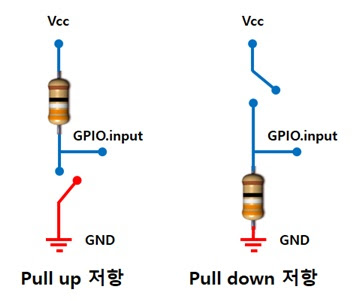

## 피에조 버저
Duration: 0:03:00

**전기가 통하면 소리가 나는 반도체 소자!**

Buzzer란 우리가 일상 생활에서 이미 많이 사용하고 있는 소자입니다. 버스 벨이나 초인종과 같은 기능으로 사용하기도 합니다.

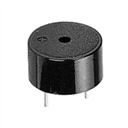

<aside class="positive">
농구에서 경기 시간이 종료 Buzzer가 울릴때 던진 슛을 Buzzer Beater 버저비터라고 합니다.
</aside>

Buzzer가 우리가 원하는 소리를 내게 하기 위해서는 주파수의 개념을 이해해야 합니다. 주파수는 1초 동안 전파나 음파가 진동하는 횟수를 뜻합니다.

- [슬기로운 전기생활을 위한 전기상식용어 ‘주파수’](https://news.samsungsemiconductor.com/kr/%EC%8A%AC%EA%B8%B0%EB%A1%9C%EC%9A%B4-%EC%A0%84%EA%B8%B0%EC%83%9D%ED%99%9C%EC%9D%84-%EC%9C%84%ED%95%9C-%EC%A0%84%EA%B8%B0%EC%83%81%EC%8B%9D%EC%9A%A9%EC%96%B4-%EC%A3%BC%ED%8C%8C%EC%88%98/)


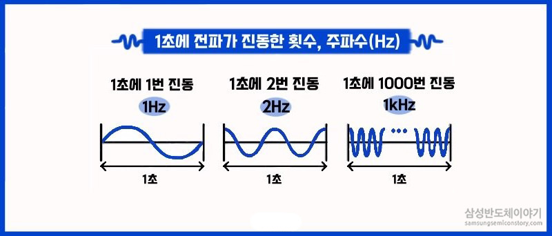

소리는 주파수에 따라서 음의 높낮이가 다르며, Buzzer에 흐르는 전류를 주파수를 변경하면 소리를 변경할 수 있습니다. Buzzer에 입력되는 전류의 주파수가 높을 수록 고음이 발생합니다.

## 회로 만들기
Duration: 0:12:00

이제 버튼을 눌러서 버저를 통해서 소리를 내는 회로를 만들어 보겠습니다. 우선 브레드보드의 중간을 아래와 같이 연결해 주세요.

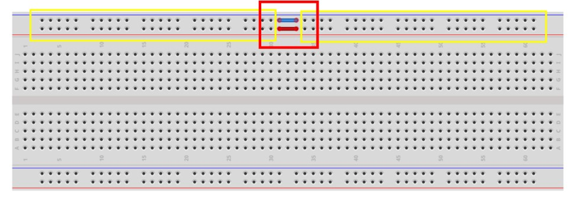

점퍼선의 색상은 아무거나 상관없어요.

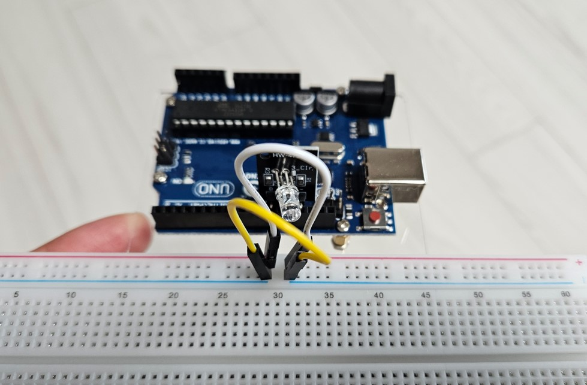

다음으로 피에조 버저를 브레드보드 왼쪽 끝에 꽂아주세요. +가 왼쪽으로 오게 꽂으면 됩니다. 비스듬히 꽂아도 됩니다.

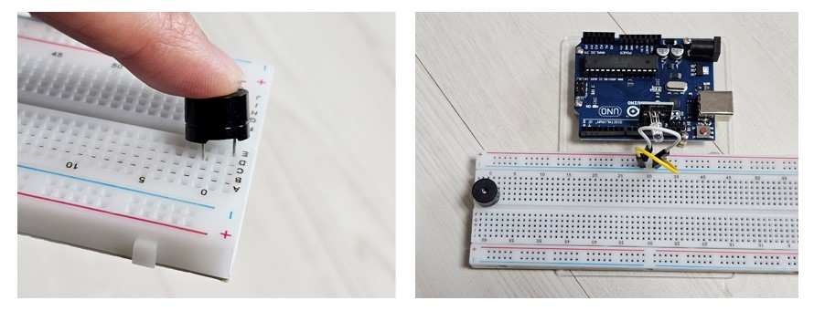

버튼을 아래와 같이 꽂아주세요. 버튼 색상은 마음대로 해도 됩니다. 하지만 핀은 아래 사진처럼 두 개가 다른 줄에 꽂혀야 해요. 브레드보드의 5개 구멍은 모두 연결되어 있기 때문에 버튼의 두 핀이 떨어져 있어야 스위치가 제대로 동작할 수 있어요.

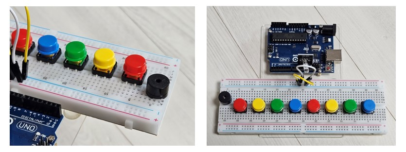

다음은 저항을 연결해 주겠습니다. 저항은 스위치의 다리 한 쪽과 브레드보드의 `-선`과 연결해주세요. 버저는 저항을 연결하지 않아도 됩니다.

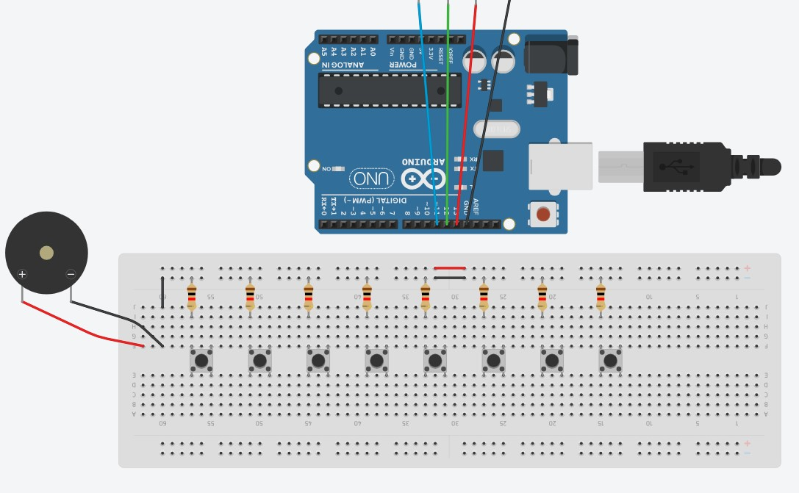
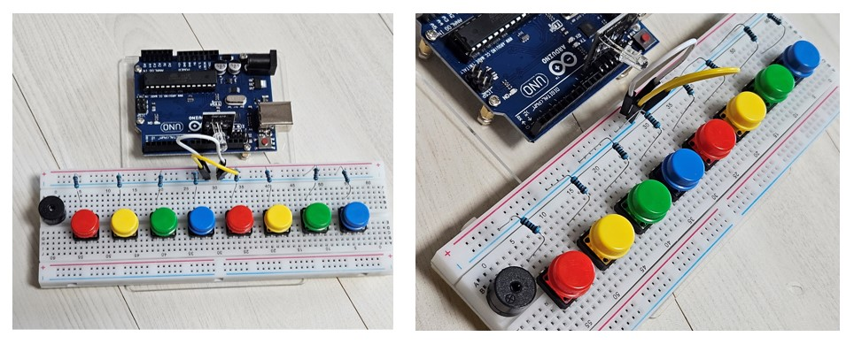

다음으로는 스위치와 브레드보드의 `+선`과 연결해 주세요. 버튼 스위치의 두 핀을 각각 `-선`과 `+선`에 연결해서 회로를 만들어 주는거에요.

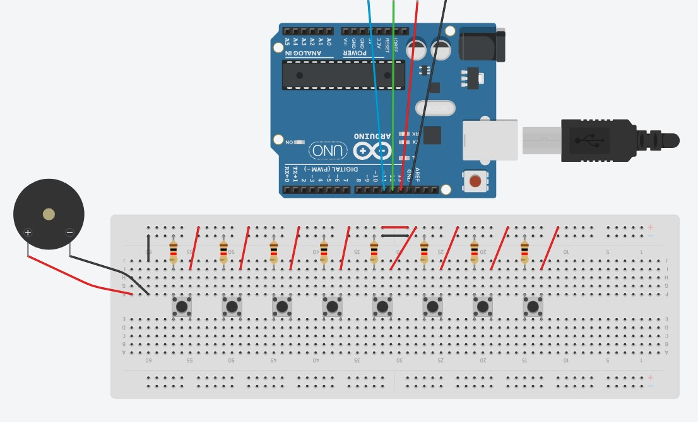
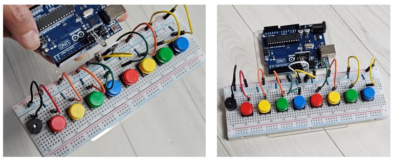

이제 브레드보드의 `-선`과 `+선`을 각각 아두이노와 연결합니다. `-선`은 `GND`와 `+선`은 `5V`와 연결해줍니다.

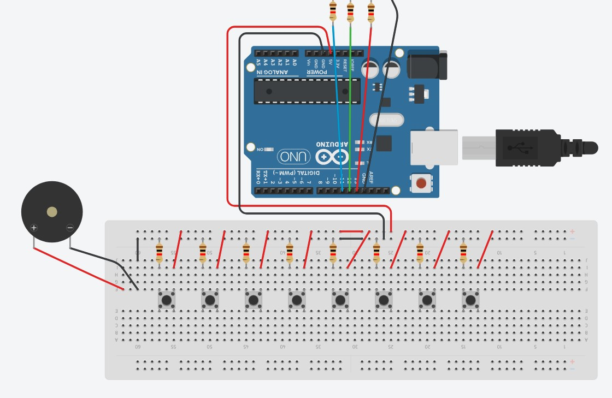
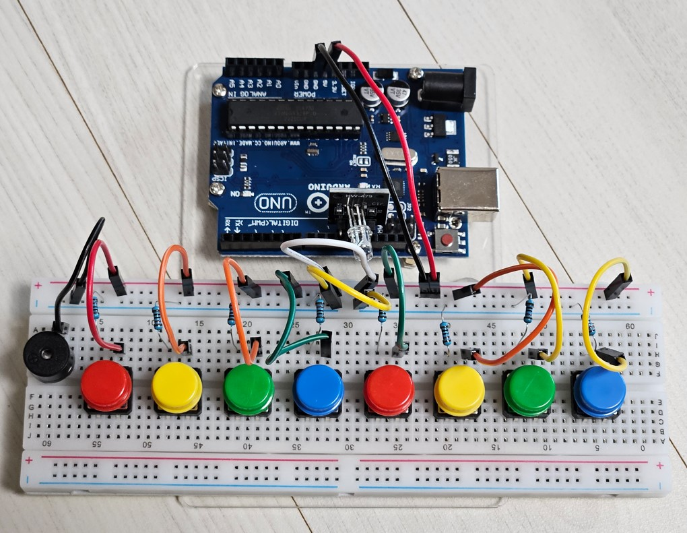

이제 마지막으로 버저와 버튼 스위치에 신호를 주고 받을 핀을 연결해 줍니다. 버저부터 차례대로 아두이노 보드의 DIGITAL 2번 핀부터 10번 핀까지 연결합니다.

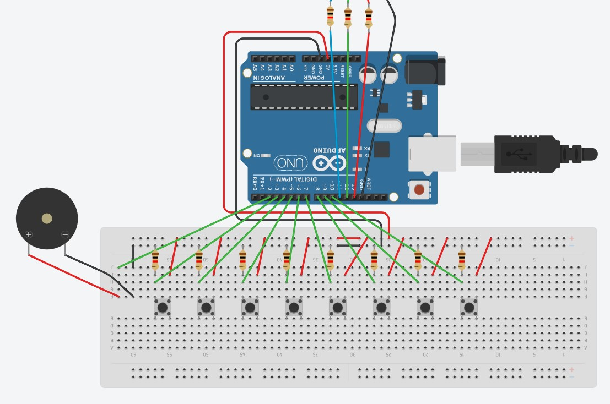
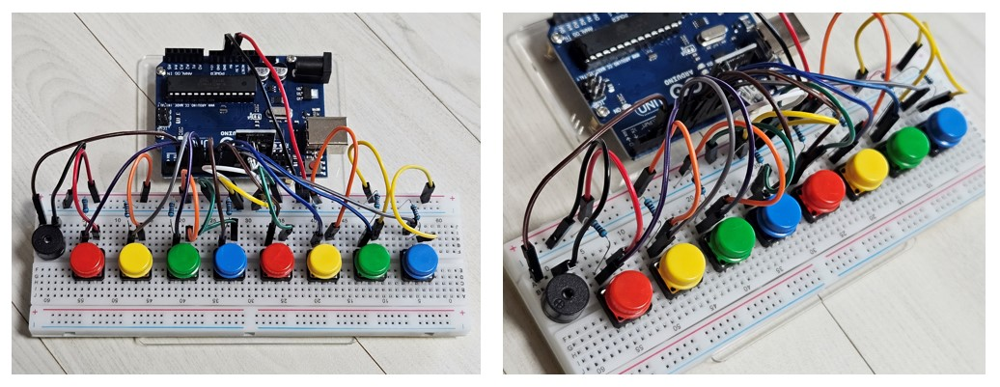

## 프로그램 만들기
Duration: 0:04:00

이제 버튼을 누르면 버저에서 소리가 나는 프로그램을 작성해보겠습니다. 만들어진 프로그램을 파일로 불러와서 아두이노 IDE에서 아두이노로 업로드 해보세요. `piano.ino`파일 입니다.

프로그램 코드는 아래와 같아요. 천천히 살펴보고 프로그램을 바꿔서 내 마음대로 동작을 바꿔 보아도 좋아요.

```c
#define BUZZER_PIN 2   // LED의 R 핀과 연결된 아두이노 핀 번호 
#define LED_RED_PIN 13   // LED의 R 핀과 연결된 아두이노 핀 번호 
#define LED_GREEN_PIN 12 // LED의 G 핀과 연결된 아두이노 핀 번호
#define LED_BLUE_PIN 11  // LED의 B 핀과 연결된 아두이노 핀 번호

#define NOTE_C4  262 //4옥타브 도에 해당하는 주파수
#define NOTE_D4  294 //4옥타브 레에 해당하는 주파수
#define NOTE_E4  330 //4옥타브 미에 해당하는 주파수
#define NOTE_F4  349 //4옥타브 파에 해당하는 주파수
#define NOTE_G4  392 //4옥타브 솔에 해당하는 주파수
#define NOTE_A4  440 //4옥타브 라에 해당하는 주파수
#define NOTE_B4  494 //4옥타브 시에 해당하는 주파수
#define NOTE_C5  523 //5옥타브 도에 해당하는 주파수

void setup() {
    pinMode(3, INPUT);   // 디지털 3번핀을 입력모드로 설정
    pinMode(4, INPUT);   // 디지털 4번핀을 입력모드로 설정
    pinMode(5, INPUT);   // 디지털 5번핀을 입력모드로 설정
    pinMode(6, INPUT);   // 디지털 6번핀을 입력모드로 설정
    pinMode(7, INPUT);   // 디지털 7번핀을 입력모드로 설정
    pinMode(8, INPUT);   // 디지털 8번핀을 입력모드로 설정
    pinMode(9, INPUT);   // 디지털 9번핀을 입력모드로 설정
    pinMode(10, INPUT);  // 디지털 10번핀을 입력모드로 설정

    pinMode(BUZZER_PIN, OUTPUT);     // 디지털 2번핀을 출력모드로 설정
    pinMode(LED_RED_PIN, OUTPUT);    // 디지털 11번핀을 출력모드로 설정
    pinMode(LED_GREEN_PIN, OUTPUT);  // 디지털 12번핀을 출력모드로 설정
    pinMode(LED_BLUE_PIN, OUTPUT);   // 디지털 13번핀을 출력모드로 설정
    Serial.begin(9600);              // 디버깅을 위한 시리얼 통신 설정
} 


void loop() {
    digitalWrite(LED_RED_PIN, LOW);   // LED의 R 핀을 출력을 LOW으로 변경
    digitalWrite(LED_GREEN_PIN, LOW); // LED의 G 핀을 출력을 LOW으로 변경
    digitalWrite(LED_BLUE_PIN, LOW);  // LED의 B 핀을 출력을 LOW으로 변경

    if (digitalRead(3) == HIGH) {         // 만약 10번핀에 HIGH신호가 입력되면
        tone (BUZZER_PIN, NOTE_C4);           // 2번핀에 주파수 246의 신호를 출력
        digitalWrite(LED_RED_PIN, HIGH);  // LED_RED_PIN 핀의 출력을 HIGH로 설정하여 LED 모듈(빨간색) 발광
        Serial.println("3 on");          // 아두이노 IDE 시리얼 모니터에 "9 on" 출력
    }

    else if (digitalRead(4) == HIGH) {    // 위 조건이 해당 하지 않고 만약 8번에 HIGH 신호가 입력되면
        tone (BUZZER_PIN, NOTE_D4);           // 2번핀에 주파수 261의 신호를 출력
        digitalWrite(LED_GREEN_PIN, HIGH);// LED_GREEN_PIN핀의 출력을 HIGH로 설정하여 LED 모듈(초록색) 발광
        Serial.println("4 on");
    }

    else if (digitalRead(5) == HIGH) {    // 위 조건이 해당 하지 않고 만약 9번핀에 HIGH신호가 입력되면
        tone (BUZZER_PIN, NOTE_E4);           // 2번핀에 주파수 294의 신호를 출력
        digitalWrite(LED_BLUE_PIN,HIGH);  // LED_BLUE_PIN핀의 출력을 HIGH로 설정하여 LED 모듈(파란색) 발광
        Serial.println("5 on");
    }

    else if (digitalRead(6) == HIGH) {
        tone (BUZZER_PIN, NOTE_F4);
        digitalWrite(LED_RED_PIN,HIGH);
        Serial.println("6 on");
    }

    else if (digitalRead(7) == HIGH) {
        tone (BUZZER_PIN, NOTE_G4);
        digitalWrite(LED_GREEN_PIN, HIGH);
        Serial.println("7 on");
    }

    else if (digitalRead(8) == HIGH) {
        tone (BUZZER_PIN, NOTE_A4);
        digitalWrite(LED_BLUE_PIN, HIGH);
        Serial.println("8 on");
    }

    else if (digitalRead(9) == HIGH) {
        tone (BUZZER_PIN, NOTE_B4);
        digitalWrite(LED_RED_PIN, HIGH);
        Serial.println("9 on");
    }

    else if (digitalRead(10) == HIGH) {
        tone (BUZZER_PIN, NOTE_C5);
        digitalWrite(LED_GREEN_PIN, HIGH);
        Serial.println("10 on");
    }

    else{
        noTone(BUZZER_PIN);              // 아무 입력이 없을때 2번 핀의 Tone 함수 사용 안함
        Serial.println("off");
    }
}
```

`tone`은 버저가 연결된 핀으로 특정 주파수의 신호를 보낼 수 있어요. `noTone`은 아무런 신호를 보내지 않을때, 즉 소리를 내고 싶지 않을 때 사용할 수 있어요.

`Serial.begin(9600)`은 아두이노가 제대로 동작하고 있는지 확인하고 싶을 때 아두이도 IDE와 통신하기 위해서 사용하는 것이에요. `Serial.println`를 통해서 아두이노의 동작을 아두이노 IDE 시리얼 모니터에 글자나 값으로 표시할 수 있어요. 자세한 것은 아래 글을 참고하세요.

- [아두이노 시작하기(2) - 아두이노 IDE 시리얼 모니터 사용해보기](https://blog.naver.com/rence92/220736278731)

음계마다 어떤 주파수를 갖는지는 표를 보고 확인 할 수 있어요.

[](https://m.blog.naver.com/geniusus/221549772862)

## 정리
Duration: 0:01:00

이제 버튼을 누르면 전기 신호가 아두이노 보드가 들어오고, 그 신호를 받아서 다시 버저에 신호를 보내는 회로와 프로그램이 완성되었습니다. 마치 피아노 같네요.


프로그램을 이해해하면 내가 원하는 대로 동작을 바꿔 볼 수 있어요. 지금까지 배운 내용으로 다른 회로와 프로그램을 만들어 보세요.

- 버튼이 눌렸을 때 색상을 바꿔보세요.
- 버튼을 눌렸을 때 나는 소리를 바꿔보세요.
- 버튼을 더 추가해 보세요.

### 참고자료

- [소스코드 파일](https://github.com/msaltnet/jinju-coding/tree/main/code)
- [Arduino 스위치, 풀다운저항, 풀업저항](https://stemwith.github.io/2018/09/01/Arduino-%EC%8A%A4%EC%9C%84%EC%B9%98-%ED%92%80%EB%8B%A4%EC%9A%B4-%ED%92%80%EC%97%85%EC%A0%80%ED%95%AD/)
- [아두이노 택트 스위치 원리 알아보기](https://m.blog.naver.com/eduino/220908567028)
- [슬기로운 전기생활을 위한 전기상식용어 ‘주파수’](https://news.samsungsemiconductor.com/kr/%EC%8A%AC%EA%B8%B0%EB%A1%9C%EC%9A%B4-%EC%A0%84%EA%B8%B0%EC%83%9D%ED%99%9C%EC%9D%84-%EC%9C%84%ED%95%9C-%EC%A0%84%EA%B8%B0%EC%83%81%EC%8B%9D%EC%9A%A9%EC%96%B4-%EC%A3%BC%ED%8C%8C%EC%88%98/)
