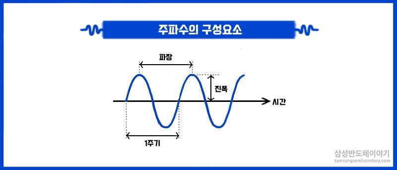

author: Jeong Seongmoon
summary: 버튼으로 소리내기
id: button
categories: codelab
environments: Web
status: Published
feedback link: https://github.com/msaltnet/jinju-coding

# 버튼으로 소리내기

## 시작하기
Duration: 0:02:00

스위치와 부저에 대해서 알아보고, 스위치 버튼을 눌러서 피에조 부저를 통해 소리를 내는 회로와 프로그램을 만들어 봅니다.

### 사전 준비
1. 아두이노 보드
1. 아두이노와 연결 가능한 PC와 IDE
1. 브레드보드
1. 버튼(택트 스위치) 부품
1. 저항 10K옴
1. 피에조 버저

### 배우게 될 것
1. 버튼(스위치)이 무엇인지
1. 버저를 통해 소리가 나는 원리
1. 버튼가 버저를 사용해서 소리는 내는 회로만들어 보기
1. 프로그램 만들고 실행해보기

## 스위치
Duration: 0:03:00

스위치는 회로 중간에서 손쉽게 회로를 연결하거나 끊어주는 역할을 하는 부품입니다.

우리가 사용할 부품은 tactile switch로 tact 스위치라고 하는 부품입니다.

전류를 흘러서 만든 회로는 아래 그림처럼 간단하게 그리기도 합니다.

중요한 것은 스위치를 회로에 연결해 줄 때 저항을 같이 연결해줘야 합니다. **저항없이 스위치를 연결하면 회로와 부품이 망가질 수 있어요!!!**

그래서 아래처럼 회로 중간에 저항을 함께 연결해 주어야 해요.

저항을 연결해주는 위치에 따라서 스위치가 눌렸을 때 신호가 다르게 동작하는데, 스위치를 누르지 않았을 때 높은 전압을 유지하도록 하는 것을 Pull-Up, 반대의 경우는 Pull-Down이라고 해요.

## 피에조 버저
Duration: 0:03:00

**전기가 통하면 소리가 나는 반도체 소자!**

Buzzer란 우리가 일상 생활에서 이미 많이 사용하고 있는 소자입니다. 버스 벨이나 초인종과 같은 기능으로 사용하기도 합니다.

<aside class="positive">
농구에서 경기 시간이 종료 Buzzer가 울릴때 던진 슛을 Buzzer Beater 버저비터라고 합니다.
</aside>

Buzzer가 우리가 원하는 소리를 내게 하기 위해서는 주파수의 개념을 이해해야 합니다. 주파수는 1초 동안 전파나 음파가 진동하는 횟수를 뜻합니다.

- [슬기로운 전기생활을 위한 전기상식용어 ‘주파수’](https://news.samsungsemiconductor.com/kr/%EC%8A%AC%EA%B8%B0%EB%A1%9C%EC%9A%B4-%EC%A0%84%EA%B8%B0%EC%83%9D%ED%99%9C%EC%9D%84-%EC%9C%84%ED%95%9C-%EC%A0%84%EA%B8%B0%EC%83%81%EC%8B%9D%EC%9A%A9%EC%96%B4-%EC%A3%BC%ED%8C%8C%EC%88%98/)

소리는 주파수에 따라서 음의 높낮이가 다르며, Buzzer에 흐르는 전류를 주파수를 변경하면 소리를 변경할 수 있습니다. Buzzer에 입력되는 전류의 주파수가 높을 수록 고음이 발생합니다.

## 회로 만들기
Duration: 0:05:00

// 회로 만들기 실습

## 프로그램 만들기
Duration: 0:05:00

// 프로그램 만들기 실습

## 정리
Duration: 0:02:00

배우것 정리 및 보충 자료

- [Arduino 스위치, 풀다운저항, 풀업저항](https://stemwith.github.io/2018/09/01/Arduino-%EC%8A%A4%EC%9C%84%EC%B9%98-%ED%92%80%EB%8B%A4%EC%9A%B4-%ED%92%80%EC%97%85%EC%A0%80%ED%95%AD/)
- [아두이노 택트 스위치 원리 알아보기](https://m.blog.naver.com/eduino/220908567028)
- [슬기로운 전기생활을 위한 전기상식용어 ‘주파수’](https://news.samsungsemiconductor.com/kr/%EC%8A%AC%EA%B8%B0%EB%A1%9C%EC%9A%B4-%EC%A0%84%EA%B8%B0%EC%83%9D%ED%99%9C%EC%9D%84-%EC%9C%84%ED%95%9C-%EC%A0%84%EA%B8%B0%EC%83%81%EC%8B%9D%EC%9A%A9%EC%96%B4-%EC%A3%BC%ED%8C%8C%EC%88%98/)
