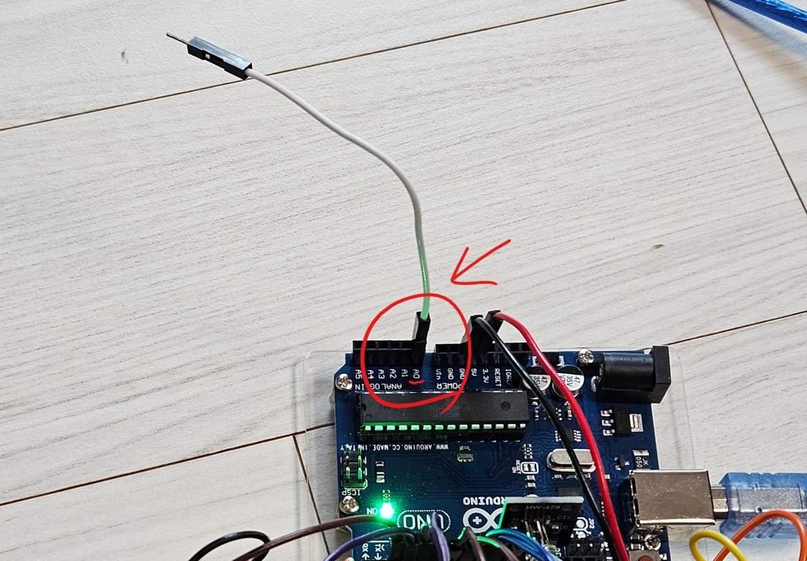
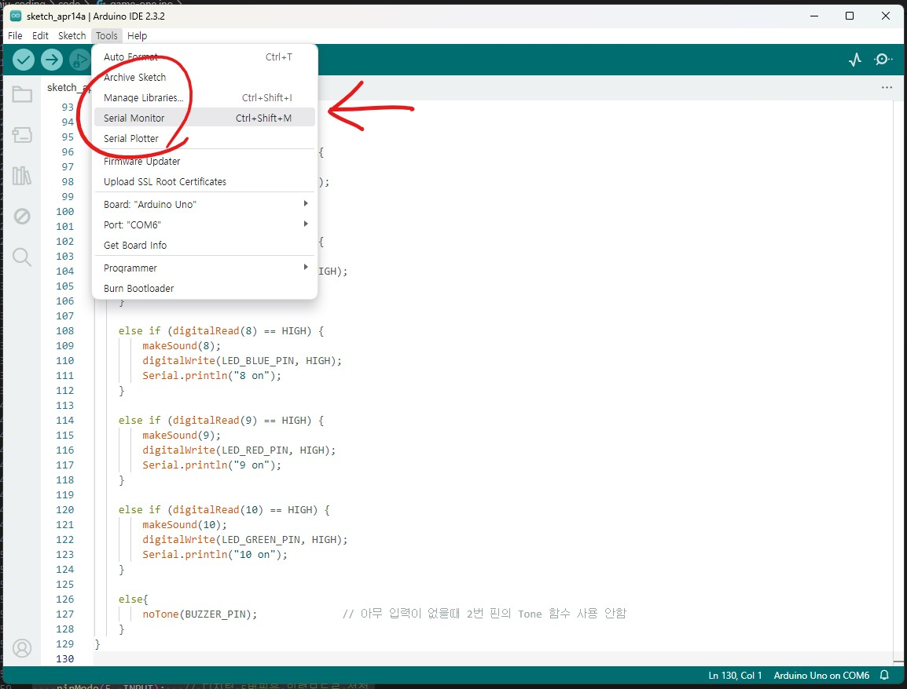

author: Jeong Seongmoon
summary: 복불복 게임 프로그램
id: game
categories: codelab
environments: Web
status: Published
feedback link: https://github.com/msaltnet/coding-camp

# 복불복 게임 프로그램

## 시작하기
Duration: 0:02:00

[버튼으로 소리내기](../button/)에서 버튼을 눌러서 신호를 발생시키고, 특정 주파수의 신호를 버저에 보내서 피아노를 만들어 보았습니다. 그 회로를 그대로 사용해서 복불복 게임 프로그램을 만들어 보겠습니다.

"복불복(福不福)은 '복이 오거나 안 오거나'라는 뜻으로 사람의 운수를 일컫는 말이다. 벌칙자를 선발하거나 식사, 상품 등에서 제외시킬 때 사용된다."

복불복 게임을 위해 8개의 버튼 중 n개의 버튼을 눌렀을 때, '삑-' 소리가 나도록 프로그램을 만들어 보겠습니다.

### 사전 준비
1. [버튼으로 소리내기](../button/)에서 완성한 보드와 회로
1. 아두이노와 연결 가능한 PC와 IDE

### 배우게 될 것
1. 무작위(랜덤)로 어떤 수를 결정하는 방법
1. 버튼을 눌렀을 때 나는 소리가 매번 달라지게 만드는 방법

## 무작위 숫자를 만들기
Duration: 0:15:00

아두이노에서 무작위로 숫자를 만드는 방법은 `random` 함수를 사용하는 것입니다.

하지만 무작위 숫자를 만드는 기준을 변경해주지 않으면 매번 같은 값의 무작위 숫자가 만들어 집니다. 그래서 `randomSeed` 함수를 사용해서 무작위 순서를 만들어주는 기준(시드)를 변경해 주어야 합니다.

무작위라는 것은 아무런 기준이 없이 계속 변해야 하는 것이므로 계속 변하는 기준 값이 있어야 합니다. 대표적인 것이 시간이나 날씨와 같은 기준입니다. 아두이노 보드에서는 아날로그 입력을 확인할 수 있는 핀이 있는데, 우리는 그 핀의 값을 읽어와서 사용하겠습니다. `analogRead(0)` 이렇게 0번 핀의 값을 읽어와서 `randomSeed`에 전달해 주도록하겠습니다.

그렇게 만들어진 아래 코드는 무작위 순서를 만드는 코드입니다.

`random(3, 11);` 이렇게 하면 3에서 10사이의 숫자 중에 하나를 무작위로 고를 수 있습니다.

```c
// makeMiss 함수는 술래를 정하는 함수이다.
// 이 함수는 3~10사이 숫자로 랜덤으로 술래를 정해서 전역 변수에 저장한다.
void makeMiss() {
    //랜덤 씨드를 설정해줘야 매번 다른 값이 나온다.
    //랜덤 씨드를 아날로그 0번핀의 값을 이용해서 설정한다.
    Serial.print("Start makeMiss: ");
    Serial.println(analogRead(0));
    randomSeed(analogRead(0));
    missPinNum = random(3, 11);
    Serial.print("missPinNum: ");
    Serial.println(missPinNum);
}
```

아날로그 신호에 더 많은 변화를 주고 싶으면 아래 사진처럼 아날로그 0번 핀에 점퍼선을 하나 연결해 보세요. 값이 더 많이 바뀝니다.



값이 변경되는 것을 시리얼 모니터로 확인하는 방법은 뒤에서 다시 알아보겠습니다.

## 술래 1명 뽑는 프로그램
Duration: 0:15:00

앞에서 만든 무작위 숫자를 만드는 함수를 사용해서 버튼을 눌렀을 때, 술래를 뽑는 게임을 만들어 보겠습니다.

무작위로 버튼 핀 번호 3~10 사이에 숫자를 하나 뽑아서 `missPinNum`에 저장하고, 버튼을 눌렀을 때 그 숫자와 같은 핀의 버튼이 눌렸을 경우 특별한 멜로디가 연주되도록 만들어 보았습니다.

**`makeMiss` 함수가 아두이노가 켜질 때 실행되기 때문에 아두이노를 리셋하면 술래가 계속 변경됩니다.**

`makeSound`는 핀 번호를 확인해서 Pass인 경우와 Miss인 경우 다른 멜로디를 연주하는 함수입니다.

버튼이 눌렸을 때, `makeSound`를 사용해서 멜로디가 연주되도록 하였습니다.

프로그램은 아래와 같고, [`game-one.ino`](https://github.com/msaltnet/jinju-coding/blob/main/code/game-one.ino) 파일을 열어서 사용할 수 있습니다.

직접 아두이노 보드에 업로드해서 실행해보세요. 코드를 바꿔서 멜로디를 바꿔보세요.

```c
#define BUZZER_PIN 2   // LED의 R 핀과 연결된 아두이노 핀 번호 
#define LED_RED_PIN 13   // LED의 R 핀과 연결된 아두이노 핀 번호 
#define LED_GREEN_PIN 12 // LED의 G 핀과 연결된 아두이노 핀 번호
#define LED_BLUE_PIN 11  // LED의 B 핀과 연결된 아두이노 핀 번호

#define NOTE_C4  262 //4옥타브 도에 해당하는 주파수
#define NOTE_D4  294 //4옥타브 레에 해당하는 주파수
#define NOTE_E4  330 //4옥타브 미에 해당하는 주파수
#define NOTE_F4  349 //4옥타브 파에 해당하는 주파수
#define NOTE_G4  392 //4옥타브 솔에 해당하는 주파수
#define NOTE_A4  440 //4옥타브 라에 해당하는 주파수
#define NOTE_B4  494 //4옥타브 시에 해당하는 주파수
#define NOTE_C5  523 //5옥타브 도에 해당하는 주파수

int missPinNum; // 버튼 핀 번호를 무작위로 뽑아서 저장

// makeSound 함수는 핀 번호가 missPinNum 배열 중 하나이면 탈락 소리를 낸다.
void makeSound(int pinNum) {
    if (missPinNum != pinNum) {
        Serial.println("Pass");
        tone(BUZZER_PIN, NOTE_E4);
        delay(100);
        tone(BUZZER_PIN, NOTE_G4);
        delay(100);
        tone(BUZZER_PIN, NOTE_C5);
        delay(150);
        tone(BUZZER_PIN, NOTE_G4);
        delay(250);
        noTone(BUZZER_PIN);
    } else {
        Serial.println("Miss");
        tone(BUZZER_PIN, NOTE_D4);
        delay(120);
        noTone(BUZZER_PIN);
        delay(30);
        tone(BUZZER_PIN, NOTE_D4);
        delay(450);
        noTone(BUZZER_PIN);
    }
}

// makeMiss 함수는 술래를 정하는 함수이다.
// 이 함수는 3~10사이 숫자로 랜덤으로 술래를 정해서 전역 변수에 저장한다.
void makeMiss() {
    //랜덤 씨드를 설정해줘야 매번 다른 값이 나온다.
    //랜덤 씨드를 아날로그 0번핀의 값을 이용해서 설정한다.
    Serial.print("Start makeMiss: ");
    Serial.println(analogRead(0));
    randomSeed(analogRead(0));
    missPinNum = random(3, 11);
    Serial.print("missPinNum: ");
    Serial.println(missPinNum);
}

void setup() {
    Serial.begin(9600);  // 디버깅을 위한 시리얼 통신 설정
    pinMode(3, INPUT);   // 디지털 3번핀을 입력모드로 설정
    pinMode(4, INPUT);   // 디지털 4번핀을 입력모드로 설정
    pinMode(5, INPUT);   // 디지털 5번핀을 입력모드로 설정
    pinMode(6, INPUT);   // 디지털 6번핀을 입력모드로 설정
    pinMode(7, INPUT);   // 디지털 7번핀을 입력모드로 설정
    pinMode(8, INPUT);   // 디지털 8번핀을 입력모드로 설정
    pinMode(9, INPUT);   // 디지털 9번핀을 입력모드로 설정
    pinMode(10, INPUT);  // 디지털 10번핀을 입력모드로 설정

    pinMode(BUZZER_PIN, OUTPUT);     // 디지털 2번핀을 출력모드로 설정
    pinMode(LED_RED_PIN, OUTPUT);    // 디지털 11번핀을 출력모드로 설정
    pinMode(LED_GREEN_PIN, OUTPUT);  // 디지털 12번핀을 출력모드로 설정
    pinMode(LED_BLUE_PIN, OUTPUT);   // 디지털 13번핀을 출력모드로 설정
    makeMiss(); // 술래를 정한다.
} 

void loop() {
    digitalWrite(LED_RED_PIN, LOW);   // LED의 R 핀을 출력을 LOW으로 변경
    digitalWrite(LED_GREEN_PIN, LOW); // LED의 G 핀을 출력을 LOW으로 변경
    digitalWrite(LED_BLUE_PIN, LOW);  // LED의 B 핀을 출력을 LOW으로 변경

    if (digitalRead(3) == HIGH) {         // 만약 10번핀에 HIGH신호가 입력되면
        makeSound(3); // 3번 핀에 대한 소리를 낸다.
        digitalWrite(LED_RED_PIN, HIGH);  // LED_RED_PIN 핀의 출력을 HIGH로 설정하여 LED 모듈(빨간색) 발광
        Serial.println("3 on");          // 아두이노 IDE 시리얼 모니터에 "9 on" 출력
    }

    else if (digitalRead(4) == HIGH) {    // 위 조건이 해당 하지 않고 만약 8번에 HIGH 신호가 입력되면
        makeSound(4); // 4번 핀에 대한 소리를 낸다.
        digitalWrite(LED_GREEN_PIN, HIGH);// LED_GREEN_PIN핀의 출력을 HIGH로 설정하여 LED 모듈(초록색) 발광
        Serial.println("4 on");
    }

    else if (digitalRead(5) == HIGH) {    // 위 조건이 해당 하지 않고 만약 9번핀에 HIGH신호가 입력되면
        makeSound(5); // 5번 핀에 대한 소리를 낸다.
        digitalWrite(LED_BLUE_PIN,HIGH);  // LED_BLUE_PIN핀의 출력을 HIGH로 설정하여 LED 모듈(파란색) 발광
        Serial.println("5 on");
    }

    else if (digitalRead(6) == HIGH) {
        makeSound(6);
        digitalWrite(LED_RED_PIN,HIGH);
        Serial.println("6 on");
    }

    else if (digitalRead(7) == HIGH) {
        makeSound(7);
        digitalWrite(LED_GREEN_PIN, HIGH);
        Serial.println("7 on");
    }

    else if (digitalRead(8) == HIGH) {
        makeSound(8);
        digitalWrite(LED_BLUE_PIN, HIGH);
        Serial.println("8 on");
    }

    else if (digitalRead(9) == HIGH) {
        makeSound(9);
        digitalWrite(LED_RED_PIN, HIGH);
        Serial.println("9 on");
    }

    else if (digitalRead(10) == HIGH) {
        makeSound(10);
        digitalWrite(LED_GREEN_PIN, HIGH);
        Serial.println("10 on");
    }

    else{
        noTone(BUZZER_PIN);              // 아무 입력이 없을때 2번 핀의 Tone 함수 사용 안함
    }
}
```

## 술래 n명 뽑는 프로그램
Duration: 0:15:00

앞에서는 술래를 한 명 뽑는 프로그램을 만들었는데, 이번에는 술래를 n명 뽑는 프로그램을 만들어 보겠습니다. 조금 어려울 수 있지만 천천히 코드를 살펴보세요.

`MISS_NUM` 숫자를 바꿔서 술래를 몇 명으로 할지 변경할 수 있습니다.

`makeMiss` 함수가 조금 복잡해졌는데, 무작위로 n개의 숫자를 뽑는데, 이 전에 뽑았던 숫자가 뽑히면 다른 숫자를 뽑을 때까지 계속 다시 뽑도록 하였습니다. 조금 어려울 수 있지만 천천히 코드를 살펴보세요.

프로그램은 아래와 같고, [`game.ino`](https://github.com/msaltnet/jinju-coding/blob/main/code/game.ino) 파일을 열어서 사용할 수 있습니다.

직접 아두이노 보드에 업로드해서 실행해보세요. 술래 숫자를 바꿔서 프로그램을 실행해보세요.

```c
#define BUZZER_PIN 2   // LED의 R 핀과 연결된 아두이노 핀 번호 
#define LED_RED_PIN 13   // LED의 R 핀과 연결된 아두이노 핀 번호 
#define LED_GREEN_PIN 12 // LED의 G 핀과 연결된 아두이노 핀 번호
#define LED_BLUE_PIN 11  // LED의 B 핀과 연결된 아두이노 핀 번호

#define NOTE_C4  262 //4옥타브 도에 해당하는 주파수
#define NOTE_D4  294 //4옥타브 레에 해당하는 주파수
#define NOTE_E4  330 //4옥타브 미에 해당하는 주파수
#define NOTE_F4  349 //4옥타브 파에 해당하는 주파수
#define NOTE_G4  392 //4옥타브 솔에 해당하는 주파수
#define NOTE_A4  440 //4옥타브 라에 해당하는 주파수
#define NOTE_B4  494 //4옥타브 시에 해당하는 주파수
#define NOTE_C5  523 //5옥타브 도에 해당하는 주파수

#define MISS_NUM 3 // 술래를 몇 명으로 할지 정하는 상수
int missPinNum[MISS_NUM]; // 버튼 핀 번호를 무작위로 뽑아서 저장하는 배열

// makeSound 함수는 핀 번호가 missPinNum 배열 중 하나이면 탈락 소리를 낸다.
void makeSound(int pinNum) {
    if (isPass(pinNum)) {
        Serial.println("Pass");
        tone(BUZZER_PIN, NOTE_E4);
        delay(100);
        tone(BUZZER_PIN, NOTE_G4);
        delay(100);
        tone(BUZZER_PIN, NOTE_C5);
        delay(150);
        tone(BUZZER_PIN, NOTE_G4);
        delay(250);
        noTone(BUZZER_PIN);
    } else {
        Serial.println("Miss");
        tone(BUZZER_PIN, NOTE_D4);
        delay(120);
        noTone(BUZZER_PIN);
        delay(30);
        tone(BUZZER_PIN, NOTE_D4);
        delay(450);
        noTone(BUZZER_PIN);
    }
}

// makeMiss 함수는 술래를 정하는 함수이다.
// 이 함수는 3~10사이 숫자로 랜덤으로 술래를 정해서 전역 변수에 저장한다.
void makeMiss() {
    //랜덤 씨드를 설정해줘야 매번 다른 값이 나온다.
    //랜덤 씨드를 아날로그 0번핀의 값을 이용해서 설정한다.
    Serial.print("Start makeMiss: ");
    Serial.println(analogRead(0));
    randomSeed(analogRead(0));
    //missPinNum에 3~10사이의 같지 않은 무작위 숫자를 저장한다.
    for (int i = 0; i < MISS_NUM; i++) {
        int num = random(3, 11);
        while(1) {
            bool isSame = false;
            for (int j = 0; j < i; j++) {
                if (missPinNum[j] == num) {
                    isSame = true;
                    break;
                }
            }
            if (isSame) {
                num = random(3, 11);
            } else {
                break;
            }
        }
        missPinNum[i] = num;
        Serial.print("missPinNum: ");
        Serial.println(num);
    }
}

bool isPass(int pinNum) {
    for (int i = 0; i < MISS_NUM; i++) {
        if (missPinNum[i] == pinNum) {
            return false;
        }
    }
    return true;
}

void setup() {
    Serial.begin(9600);  // 디버깅을 위한 시리얼 통신 설정
    pinMode(3, INPUT);   // 디지털 3번핀을 입력모드로 설정
    pinMode(4, INPUT);   // 디지털 4번핀을 입력모드로 설정
    pinMode(5, INPUT);   // 디지털 5번핀을 입력모드로 설정
    pinMode(6, INPUT);   // 디지털 6번핀을 입력모드로 설정
    pinMode(7, INPUT);   // 디지털 7번핀을 입력모드로 설정
    pinMode(8, INPUT);   // 디지털 8번핀을 입력모드로 설정
    pinMode(9, INPUT);   // 디지털 9번핀을 입력모드로 설정
    pinMode(10, INPUT);  // 디지털 10번핀을 입력모드로 설정

    pinMode(BUZZER_PIN, OUTPUT);     // 디지털 2번핀을 출력모드로 설정
    pinMode(LED_RED_PIN, OUTPUT);    // 디지털 11번핀을 출력모드로 설정
    pinMode(LED_GREEN_PIN, OUTPUT);  // 디지털 12번핀을 출력모드로 설정
    pinMode(LED_BLUE_PIN, OUTPUT);   // 디지털 13번핀을 출력모드로 설정
    makeMiss(); // 술래를 정한다.
} 

void loop() {
    digitalWrite(LED_RED_PIN, LOW);   // LED의 R 핀을 출력을 LOW으로 변경
    digitalWrite(LED_GREEN_PIN, LOW); // LED의 G 핀을 출력을 LOW으로 변경
    digitalWrite(LED_BLUE_PIN, LOW);  // LED의 B 핀을 출력을 LOW으로 변경

    if (digitalRead(3) == HIGH) {         // 만약 10번핀에 HIGH신호가 입력되면
        makeSound(3);
        digitalWrite(LED_RED_PIN, HIGH);  // LED_RED_PIN 핀의 출력을 HIGH로 설정하여 LED 모듈(빨간색) 발광
        Serial.println("3 on");          // 아두이노 IDE 시리얼 모니터에 "9 on" 출력
    }

    else if (digitalRead(4) == HIGH) {    // 위 조건이 해당 하지 않고 만약 8번에 HIGH 신호가 입력되면
        makeSound(4);
        digitalWrite(LED_GREEN_PIN, HIGH);// LED_GREEN_PIN핀의 출력을 HIGH로 설정하여 LED 모듈(초록색) 발광
        Serial.println("4 on");
    }

    else if (digitalRead(5) == HIGH) {    // 위 조건이 해당 하지 않고 만약 9번핀에 HIGH신호가 입력되면
        makeSound(5);
        digitalWrite(LED_BLUE_PIN,HIGH);  // LED_BLUE_PIN핀의 출력을 HIGH로 설정하여 LED 모듈(파란색) 발광
        Serial.println("5 on");
    }

    else if (digitalRead(6) == HIGH) {
        makeSound(6);
        digitalWrite(LED_RED_PIN,HIGH);
        Serial.println("6 on");
    }

    else if (digitalRead(7) == HIGH) {
        makeSound(7);
        digitalWrite(LED_GREEN_PIN, HIGH);
        Serial.println("7 on");
    }

    else if (digitalRead(8) == HIGH) {
        makeSound(8);
        digitalWrite(LED_BLUE_PIN, HIGH);
        Serial.println("8 on");
    }

    else if (digitalRead(9) == HIGH) {
        makeSound(9);
        digitalWrite(LED_RED_PIN, HIGH);
        Serial.println("9 on");
    }

    else if (digitalRead(10) == HIGH) {
        makeSound(10);
        digitalWrite(LED_GREEN_PIN, HIGH);
        Serial.println("10 on");
    }

    else{
        noTone(BUZZER_PIN);              // 아무 입력이 없을때 2번 핀의 Tone 함수 사용 안함
    }
}
```

## 시리얼 모니터로 확인하기
Duration: 0:05:00

무작위로 뽑은 숫자가 어떻게 정해지는지 PC로 확인하는 방법을 알아보겠습니다.

아두이노 보드를 PC에 연결한 다음 아래와 같이 아두이노 IDE 프로그램에서 Serial Monitor를 눌러서 실행해보세요.



게임 프로그램을 시작할 때 사용한 `makeMiss`에서 시리얼 모니터를 사용해서 화면에 출력하도록 작성한 코드를 통해서 PC화면에 출력이 되도록 했습니다.

```c
// makeMiss 함수는 술래를 정하는 함수이다.
// 이 함수는 3~10사이 숫자로 랜덤으로 술래를 정해서 전역 변수에 저장한다.
void makeMiss() {
    //랜덤 씨드를 설정해줘야 매번 다른 값이 나온다.
    //랜덤 씨드를 아날로그 0번핀의 값을 이용해서 설정한다.
    Serial.print("Start makeMiss: "); // 시리얼 모니터에 PC 화면에 출력
    Serial.println(analogRead(0)); // 시리얼 모니터에 PC 화면에 출력
    randomSeed(analogRead(0));
    missPinNum = random(3, 11);
    Serial.print("missPinNum: "); // 시리얼 모니터에 PC 화면에 출력
    Serial.println(missPinNum); // 시리얼 모니터에 PC 화면에 출력
}
```

아래와 같이 PC화면에 출력이 되는 것을 확인 할 수 있습니다. 아두이노 보드에 빨간색 리셋 버튼을 누르면 프로그램이 재실행되면서 계속 다른 값이 생성되는 것을 확인 할 수 있습니다.


## 정리
Duration: 0:02:00

단순히 멜로디를 연주하는 것을 넘어서 무작위 숫자를 만들고, 숫자를 저장해 두었다가 버튼의 입력에 따라서 매번 다른 멜로디를 생성하는 꽤나 복잡한 프로그램을 만들었습니다.

쉽지 않은 프로그램이지만 정보를 저장하고, 사용자의 입력을 받아서 멜로디를 재생하는 것은 여러분이 평소에 많이 사용하는 프로그램과 동일한 원리입니다. 이러한 회로와 프로그램을 아주 많이 모아서 복잡한 컴퓨터와 프로그램들을 만든다는 것을 이해할 수 있었으면 좋겠습니다.

프로그램은 얼마든지 바꿔가면서 실험을 해도 보드가 망가지지 않으니 마음껏 실험을 해보세요. 그리고, 동작이 원하는 대로 잘 안되면 앞에서 알려준 프로그램을 다시 업로드하면 됩니다.

원하는대로 프로그램을 만드는것이 잘 안되면 인터넷에서 검색을 해보면서 문제를 해결해 보세요.

- [아두이노 시작하기(2) - 아두이노 IDE 시리얼 모니터 사용해보기](https://blog.naver.com/rence92/220736278731)
